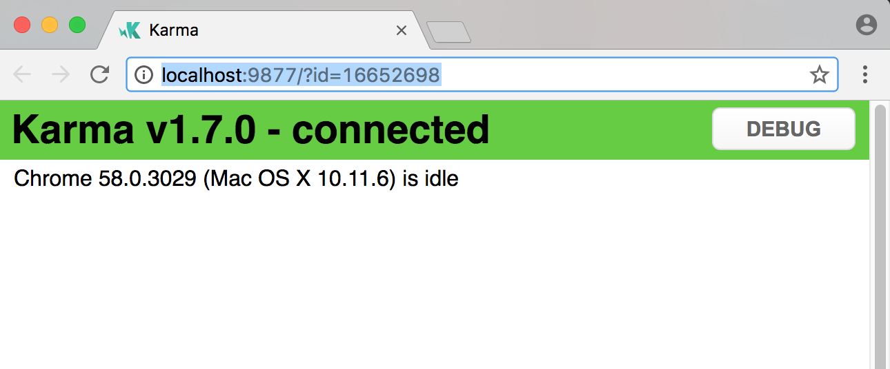

## Unit And Service testing for WebIDE features.

### Introduction

Terms and definitions:
 * [Karma](http://karma-runner.github.io/1.0/index.html) - is an open source
  test **runner** for JavaScript capable of executing tests on browsers.
  
 * [Mocha](https://mochajs.org/) - is an open source JavaScript testing framework. It provides APIs
  for writing the test suites.
  
 * [STF - Service Test Framework](../resources/tests/serviceTestFramework.js) - is a proprietary JavaScript module
  which provides utilities for starting the SAP webide inside an iframe for testing purposes.

 * **Service test** - A test which manipulates WebIDE Service/s in a running WebIDE instance.

 * **Unit test** - A test which manipulates JavaScript modules directly (**No** WebIDE instance involved).
  

The WebIDE client tools repository contains utilities and an [example](../example/template) on how to integrate
the above tools to bootstrap a testing infrastructure for WebIDE features.


### Running the provided example feature's tests.
  
Prerequisites:
 * Node.js > 4
 * Chrome Browser

Step by Step:
 * Clone this repository.
 * open [example/template](../example/template) directory.
 * ```npm install```
 * ```npm test```
 
Note that "karma_tests" is simply an npm script which triggers the karma command line command:
```karma start --singleRun```
Additional information on karma configurations and command line 
can be found in the [official docs](http://karma-runner.github.io/1.0/intro/configuration.html)

  
### Debugging the provided example feature tests.

Additional Prerequisite:
 * karma-cli package installed **globally**
   * npm install -g karma-cli
   
Step by Step:
 * open [example/template](../example/template) directory.
 
 * ```karma start```
 
 * A new chrome browser will open in a URL similar to: http://localhost:9877/?id=16652698
   - 
   
 * Press the "DEBUG" button at the top right corner.
   - It will now open the URL: http://localhost:9877/debug.html
   - 
       
 * Open Chrome Developer Tools and search for one of the test files, for example: **utilsUnitTestSpec.js**. 
 
 * Set a breakpoint in that file.
 
 * Refresh the page.
 
Note that the UI/UX in the debug.html is quite useful:
 * Click on a test name to **only** run that test.
 
 * Test failures will be shown with detailed error messages in the UI.
 

### Integrating the testing infrastructure into another feature.
  
Instead of creating a very large step by step guide which will quickly
become obsolete and incorrect, the components of the example will be listed with
their purpose and will be used as **live docs**.

The Components:

#### DevDependencies - [package.json](../package.json):

  - The "karma-*" package dependencies are plugins for karma, for example: "karma-chrome-launcher" 
    allows karma to launch chrome for testing, had we wanted to use Firefox we could have installed and configured
    the [karma-firefox-launcher](https://www.npmjs.com/package/karma-firefox-launcher) plugin.
    
  - The webide-client-tools package dependency is the **same** library developed in this repository.
    * It is highly recommended to a more specific version range constraint, the usage of "*" (latest)
      here is only for testing purposes.
       
  - The webide package dependency, provides the static resources needed to run the WebIDE locally.
        
        
#### karma configurations - [karma.conf.js](../example/template/karma.conf.js)        
 
  - Defines the options for karma to use.
  
  - The "webide-client-tools.karma.defaultProps()" is used to provide the default settings for the webide testing scenario.
  
  - It is possible to add/overwrite configurations to support different / expended scenarios.
     
  - Consult the [Official Docs for karma configurations](http://karma-runner.github.io/1.0/config/configuration-file.html)
    when making changes.
    
  - By default end users must "include" a reference to their testSetup.js and "serve" their test and production resources.
    * Note the inclusion of 'node_modules/chai/chai.js', This is an open source assertion library used in the example tests.
      However it is **not** part of the testing infrastructure and must be manually included if needed.
      
      
#### Tests runtime configurations - [testSetup.js][../example/template/test/testsSetup.js]
       
 - This file is loaded in the browser to configure globals (window props) to enable the tests bootstrapping.
 
 - The most important global is "**window.TEST_FILE_PATTERN**" which defines a regular Expression to identify
   test files and load them as require.js dependencies.
 
 - Note that this file can also be used to define "end user" globals. In this example chai APIs
   are exposed as globals.
          
         
#### The tests themselves- [serviceTestSpec.js](../example/template/test/serviceTestSpec.js) & [utilsUnitTestSpec.js](../example/template/test/utilsUnitTestSpec.js)

  - The tests are written using Mocha bdd APIs (describe/it/before/...) with chai's expect APIs for assertions.
  
  - The tests use require.js to load dependencies.
  
  - The service test loads STF (Service Tests Framework) which exposed APIs for testing a WebIDE in an iframe.
    * STF.startWebIDE(...)
    * See [JSDocs in the source](../resources/tests/serviceTestFramework.js) for detailed APIs info. 
